# UML Lab Exam Prediction Pack

This practice pack is based on the PDF lecture/homework files in `Downloads\객지프` and the Java projects in the Eclipse workspace. The problems are written in the likely exam style: an English specification plus a UML class diagram.

Assume Java, Eclipse, default package, and console I/O unless a problem says otherwise.

## Highest-Priority Topics

1. Classes with private fields, constructors, accessors, mutators, and test classes.
2. Static fields and static methods.
3. Arrays of primitive values and arrays of objects.
4. Two-dimensional arrays with nested loops.
5. Inheritance, `super`, overriding, abstract classes, and interfaces.
6. Exception handling with `try`, `catch`, `throw`, and `throws`.
7. Text file input/output with `Scanner`, `File`, `PrintWriter`, `FileReader`, and `FileWriter`.

---

## Problem 1. Room Occupancy Tracker

Implement a class that records how many people are in each room of a building. The total number of people in all rooms must be shared by all room objects.

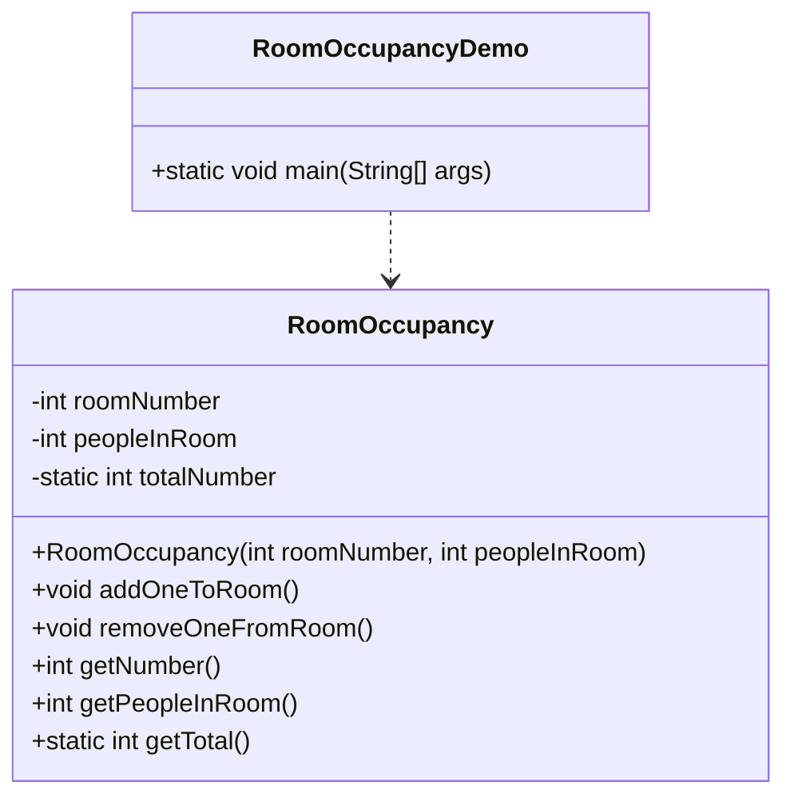
```mermaid
classDiagram
class RoomOccupancy {
  -int roomNumber
  -int peopleInRoom
  -static int totalNumber
  +RoomOccupancy(int roomNumber, int peopleInRoom)
  +void addOneToRoom()
  +void removeOneFromRoom()
  +int getNumber()
  +int getPeopleInRoom()
  +static int getTotal()
}

class RoomOccupancyDemo {
  +static void main(String[] args)
}

RoomOccupancyDemo ..> RoomOccupancy
```

Requirements:

- The constructor initializes the room number and initial people count.
- `totalNumber` must include the initial people count of every created room.
- `addOneToRoom()` increases both `peopleInRoom` and `totalNumber`.
- `removeOneFromRoom()` decreases both values only if `peopleInRoom > 0`.
- Write a demo that creates at least three room objects and prints each room count and the total.

Sample behavior:

```text
Add one to room A and three to room B.
Room A holds 1
Room B holds 3
Total in all rooms is 4
Remove one from both rooms.
Room A holds 0
Room B holds 2
Total in all rooms is 2
```

---

## Problem 2. Species Population Predictor

Implement a class that stores data about a biological species and predicts its future population.

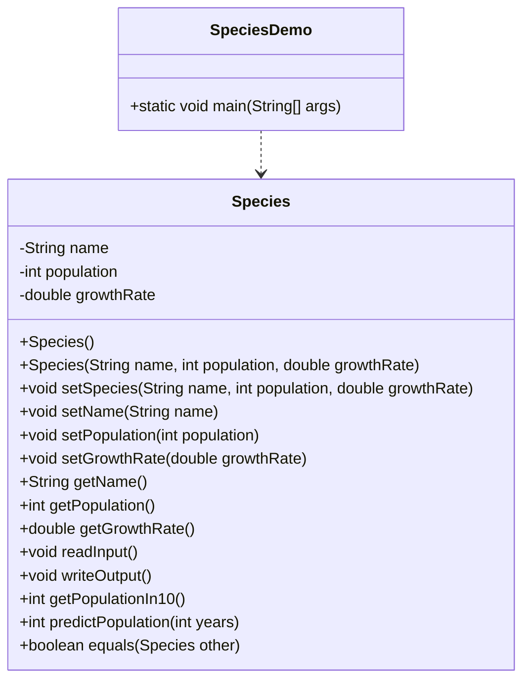
```mermaid
classDiagram
class Species {
  -String name
  -int population
  -double growthRate
  +Species()
  +Species(String name, int population, double growthRate)
  +void setSpecies(String name, int population, double growthRate)
  +void setName(String name)
  +void setPopulation(int population)
  +void setGrowthRate(double growthRate)
  +String getName()
  +int getPopulation()
  +double getGrowthRate()
  +void readInput()
  +void writeOutput()
  +int getPopulationIn10()
  +int predictPopulation(int years)
  +boolean equals(Species other)
}

class SpeciesDemo {
  +static void main(String[] args)
}

SpeciesDemo ..> Species
```

Requirements:

- `readInput()` uses `Scanner` to read name, population, and growth rate.
- Population must not be negative. If a negative value is entered, ask again.
- `predictPopulation(years)` uses repeated yearly growth.
- `getPopulationIn10()` calls or follows the same logic as `predictPopulation(10)`.
- `equals` returns true when name is equal ignoring case and the numeric fields are equal.
- Write a demo that compares two species objects and prints their predicted populations.

---

## Problem 3. Encapsulated Motor Boat

Implement a class for a motor boat. This problem focuses on constants, private fields, setters with validation, and calculation methods.

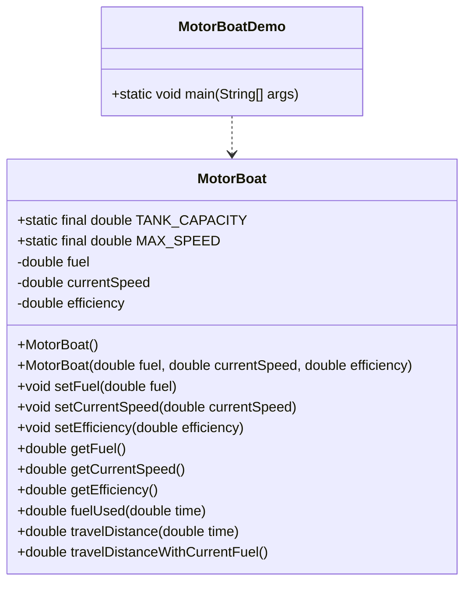
```mermaid
classDiagram
class MotorBoat {
  +static final double TANK_CAPACITY
  +static final double MAX_SPEED
  -double fuel
  -double currentSpeed
  -double efficiency
  +MotorBoat()
  +MotorBoat(double fuel, double currentSpeed, double efficiency)
  +void setFuel(double fuel)
  +void setCurrentSpeed(double currentSpeed)
  +void setEfficiency(double efficiency)
  +double getFuel()
  +double getCurrentSpeed()
  +double getEfficiency()
  +double fuelUsed(double time)
  +double travelDistance(double time)
  +double travelDistanceWithCurrentFuel()
}

class MotorBoatDemo {
  +static void main(String[] args)
}

MotorBoatDemo ..> MotorBoat
```

Requirements:

- `TANK_CAPACITY` is `60.0`.
- `MAX_SPEED` is `80.0`.
- Reject fuel values greater than `TANK_CAPACITY`.
- Reject current speed values greater than `MAX_SPEED`.
- Fuel used is `efficiency * currentSpeed * currentSpeed * time`.
- Travel distance is `currentSpeed * time`.
- Travel distance with current fuel should use the current fuel amount and current speed.

---

## Problem 4. Student Record Class

Implement a student class and a test program. This is a standard class/object lab problem.

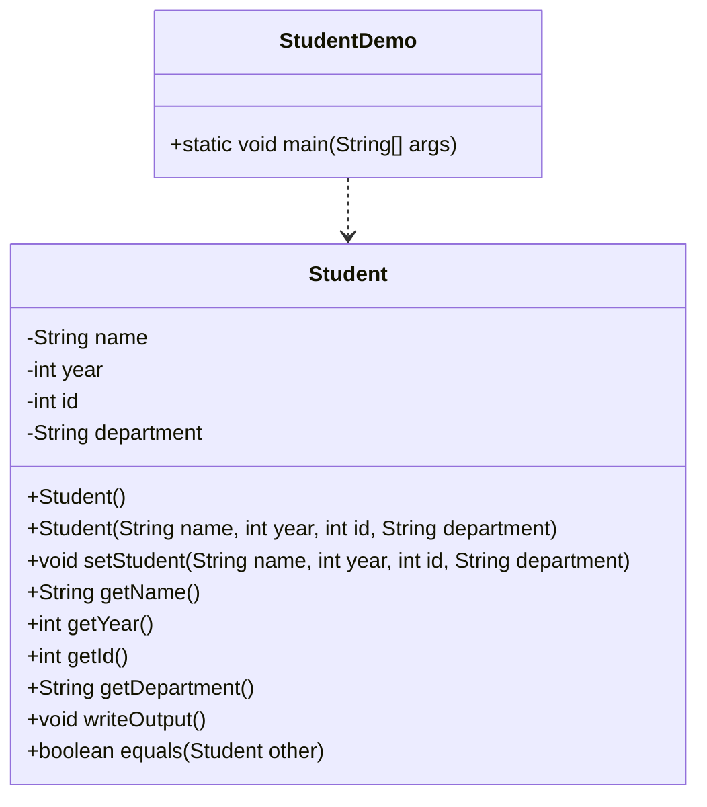
```mermaid
classDiagram
class Student {
  -String name
  -int year
  -int id
  -String department
  +Student()
  +Student(String name, int year, int id, String department)
  +void setStudent(String name, int year, int id, String department)
  +String getName()
  +int getYear()
  +int getId()
  +String getDepartment()
  +void writeOutput()
  +boolean equals(Student other)
}

class StudentDemo {
  +static void main(String[] args)
}

StudentDemo ..> Student
```

Requirements:

- The no-argument constructor should set meaningful default values.
- `setStudent` changes all fields.
- `writeOutput` prints all fields clearly.
- `equals` returns true when the student IDs are the same.
- The demo creates two students, modifies one, prints both, and compares them.

---

## Problem 5. Sales Reporter With Array Objects

Implement a report system for sales associates. This problem tests arrays of objects.

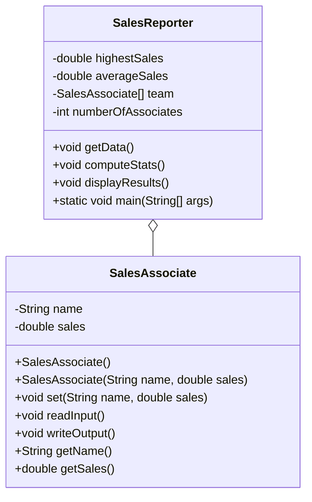
```mermaid
classDiagram
class SalesAssociate {
  -String name
  -double sales
  +SalesAssociate()
  +SalesAssociate(String name, double sales)
  +void set(String name, double sales)
  +void readInput()
  +void writeOutput()
  +String getName()
  +double getSales()
}

class SalesReporter {
  -double highestSales
  -double averageSales
  -SalesAssociate[] team
  -int numberOfAssociates
  +void getData()
  +void computeStats()
  +void displayResults()
  +static void main(String[] args)
}

SalesReporter o-- SalesAssociate
```

Requirements:

- Ask the user how many associates will be entered.
- Create an array of `SalesAssociate` objects.
- Read each associate's name and sales amount.
- Compute the average sales amount.
- Find the highest sales amount.
- Print every associate whose sales amount equals the highest amount.

---

## Problem 6. Time Book With Two-Dimensional Arrays

Implement a weekly time book. This problem tests 2D arrays and nested loops.

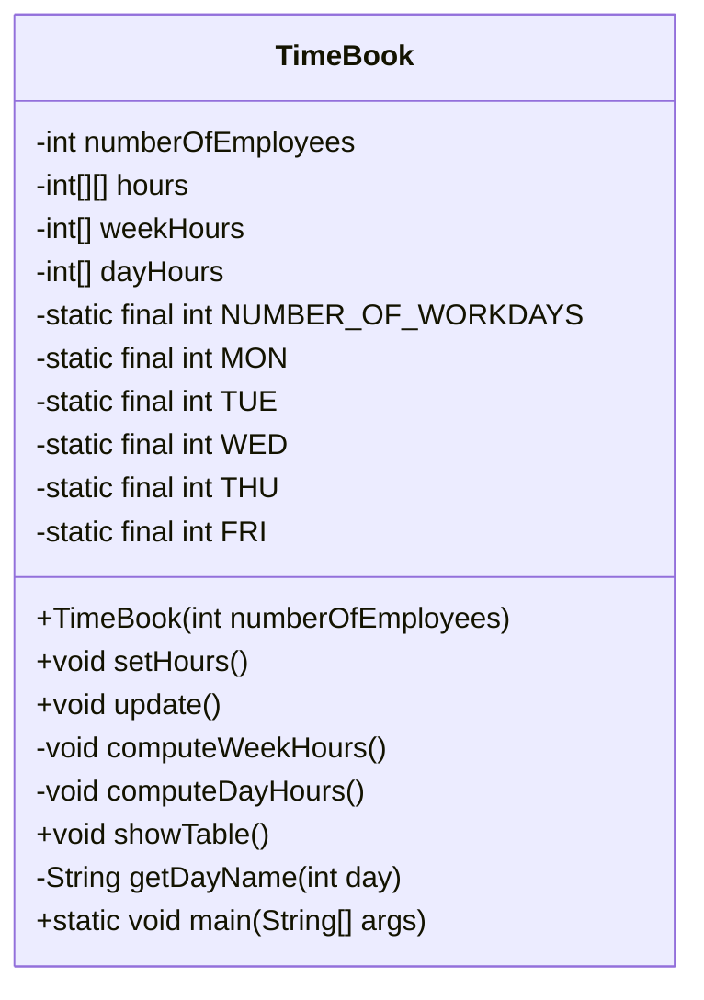
```mermaid
classDiagram
class TimeBook {
  -int numberOfEmployees
  -int[][] hours
  -int[] weekHours
  -int[] dayHours
  -static final int NUMBER_OF_WORKDAYS
  -static final int MON
  -static final int TUE
  -static final int WED
  -static final int THU
  -static final int FRI
  +TimeBook(int numberOfEmployees)
  +void setHours()
  +void update()
  -void computeWeekHours()
  -void computeDayHours()
  +void showTable()
  -String getDayName(int day)
  +static void main(String[] args)
}
```

Requirements:

- `hours[day][employee]` stores one employee's hours for one day.
- `computeWeekHours()` totals each employee's week.
- `computeDayHours()` totals all employees for each day.
- `showTable()` prints a table with day names, daily totals, and weekly totals.
- Use nested loops. Do not hard-code every total.

---

## Problem 7. Figure Finder Utility

Write a static method that converts a 2D picture array into a 0/1 figure map.

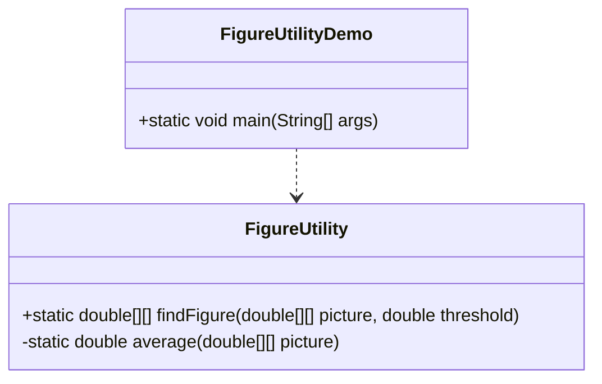
```mermaid
classDiagram
class FigureUtility {
  +static double[][] findFigure(double[][] picture, double threshold)
  -static double average(double[][] picture)
}

class FigureUtilityDemo {
  +static void main(String[] args)
}

FigureUtilityDemo ..> FigureUtility
```

Requirements:

- Compute the average of all values in `picture`.
- Return a new 2D array of the same size.
- Each returned element is `1.0` if the original element is greater than `average * threshold`.
- Otherwise the returned element is `0.0`.
- Write a demo with at least two threshold values.

Example rule:

```text
if picture[row][col] > average * threshold, result[row][col] = 1.0
else result[row][col] = 0.0
```

---

## Problem 8. Flower Order Utility

Implement a utility class for flower bouquet orders. This problem tests arrays, static methods, and loops.

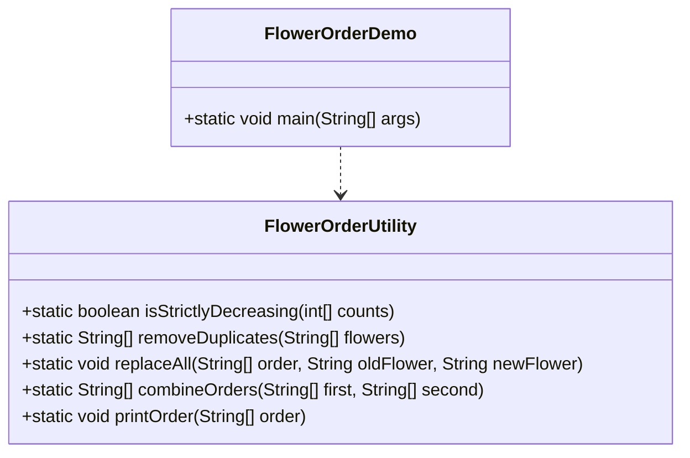
```mermaid
classDiagram
class FlowerOrderUtility {
  +static boolean isStrictlyDecreasing(int[] counts)
  +static String[] removeDuplicates(String[] flowers)
  +static void replaceAll(String[] order, String oldFlower, String newFlower)
  +static String[] combineOrders(String[] first, String[] second)
  +static void printOrder(String[] order)
}

class FlowerOrderDemo {
  +static void main(String[] args)
}

FlowerOrderDemo ..> FlowerOrderUtility
```

Requirements:

- `isStrictlyDecreasing` returns true only when every value is smaller than the previous value.
- `removeDuplicates` returns a new array that keeps the first occurrence of each flower type.
- `replaceAll` modifies the given array by replacing every matching flower name.
- `combineOrders` returns a new array containing all values from both input arrays.
- String comparisons must use `.equals`, not `==`.

---

## Problem 9. Pay Calculator Inheritance

Implement an abstract base class and two derived classes for pay calculation.

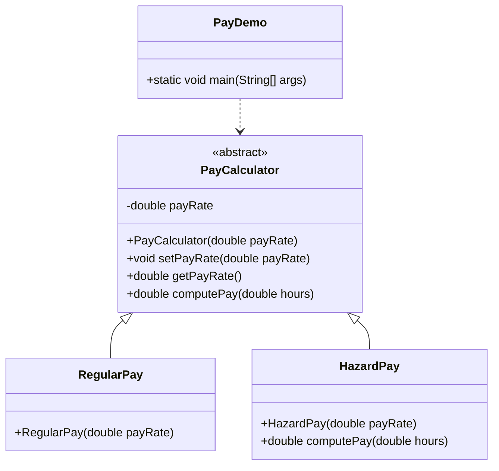
```mermaid
classDiagram
class PayCalculator {
  <<abstract>>
  -double payRate
  +PayCalculator(double payRate)
  +void setPayRate(double payRate)
  +double getPayRate()
  +double computePay(double hours)
}

class RegularPay {
  +RegularPay(double payRate)
}

class HazardPay {
  +HazardPay(double payRate)
  +double computePay(double hours)
}

class PayDemo {
  +static void main(String[] args)
}

PayCalculator <|-- RegularPay
PayCalculator <|-- HazardPay
PayDemo ..> PayCalculator
```

Requirements:

- `PayCalculator` is abstract, but `computePay` is not abstract.
- `computePay(hours)` in `PayCalculator` returns `payRate * hours`.
- `RegularPay` does not override `computePay`.
- `HazardPay` overrides `computePay` and returns `super.computePay(hours) * 1.5`.
- The demo prints pay for `40` hours and `3.5` hours.

Sample behavior:

```text
Regular pay:
40 hours at 7.5 is 300.0
3.5 hours at 10.22 is 35.77
Hazard pay:
40 hours at 7.5 is 450.0
3.5 hours at 10.22 is 53.655
```

---

## Problem 10. Person, Student, and Undergraduate

Implement an inheritance hierarchy using `super`, overriding, and equality checks.

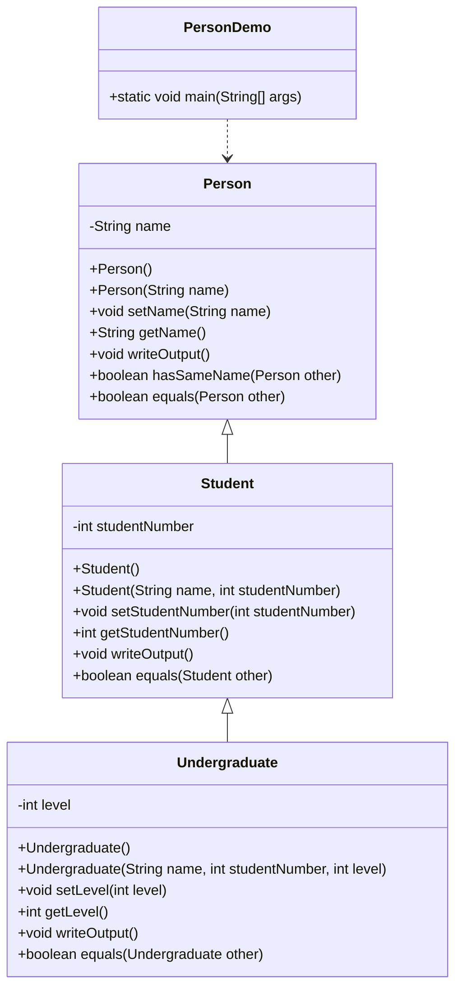
```mermaid
classDiagram
class Person {
  -String name
  +Person()
  +Person(String name)
  +void setName(String name)
  +String getName()
  +void writeOutput()
  +boolean hasSameName(Person other)
  +boolean equals(Person other)
}

class Student {
  -int studentNumber
  +Student()
  +Student(String name, int studentNumber)
  +void setStudentNumber(int studentNumber)
  +int getStudentNumber()
  +void writeOutput()
  +boolean equals(Student other)
}

class Undergraduate {
  -int level
  +Undergraduate()
  +Undergraduate(String name, int studentNumber, int level)
  +void setLevel(int level)
  +int getLevel()
  +void writeOutput()
  +boolean equals(Undergraduate other)
}

class PersonDemo {
  +static void main(String[] args)
}

Person <|-- Student
Student <|-- Undergraduate
PersonDemo ..> Person
```

Requirements:

- Subclass constructors must call the proper superclass constructor.
- `Student.writeOutput()` calls `super.writeOutput()` before printing the student number.
- `Undergraduate.writeOutput()` calls `super.writeOutput()` before printing the level.
- `hasSameName` compares names ignoring case.
- The demo creates a `Person`, a `Student`, and an `Undergraduate`.
- Include at least one polymorphic reference such as `Person p = new Student(...)`.

---

## Problem 11. Doctor Class Extending Person

Implement a `Doctor` class that extends `Person`. This problem tests inheritance, validation, `toString`, and `equals(Object)`.

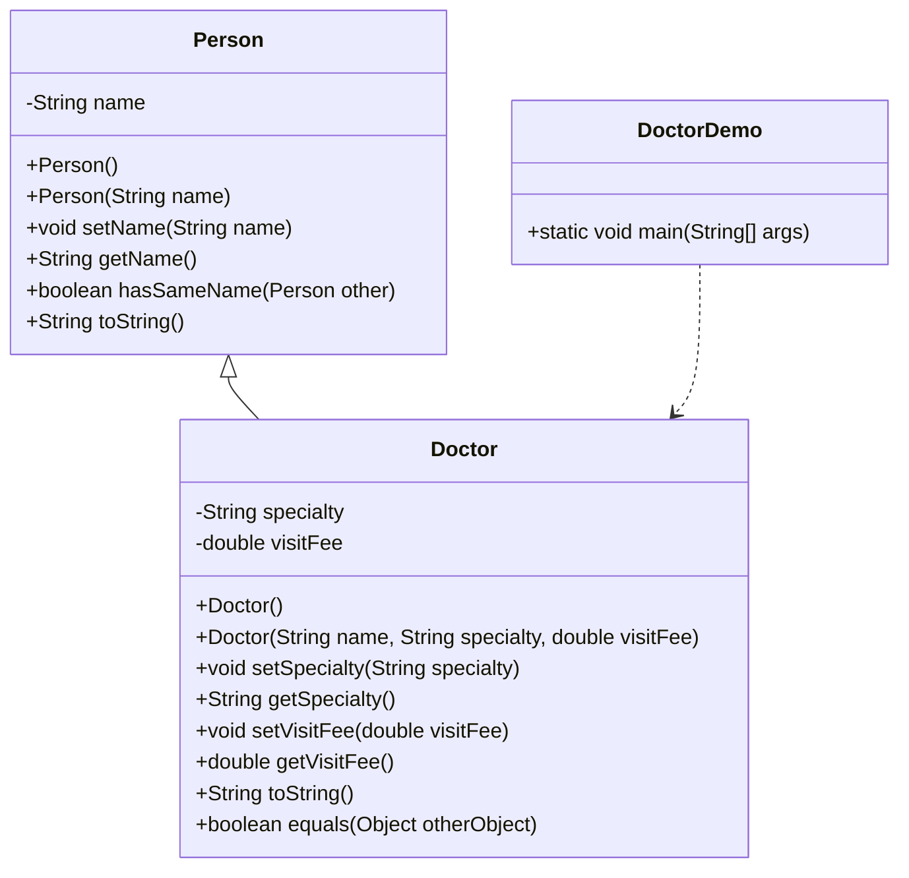
```mermaid
classDiagram
class Person {
  -String name
  +Person()
  +Person(String name)
  +void setName(String name)
  +String getName()
  +boolean hasSameName(Person other)
  +String toString()
}

class Doctor {
  -String specialty
  -double visitFee
  +Doctor()
  +Doctor(String name, String specialty, double visitFee)
  +void setSpecialty(String specialty)
  +String getSpecialty()
  +void setVisitFee(double visitFee)
  +double getVisitFee()
  +String toString()
  +boolean equals(Object otherObject)
}

class DoctorDemo {
  +static void main(String[] args)
}

Person <|-- Doctor
DoctorDemo ..> Doctor
```

Requirements:

- Valid specialties are `Medicine`, `Surgery`, `Dentist`, and `Oriental`.
- Invalid specialties should be replaced with `Medicine`.
- A negative visit fee should be replaced with `0.0`.
- `toString()` returns a multi-line description of the doctor.
- `equals(Object)` returns true only for another `Doctor` with the same name, specialty, and fee.
- Use `instanceof` before casting in `equals(Object)`.

---

## Problem 12. Measurable Shapes

Implement an interface and shape classes. This problem tests interfaces and polymorphic arrays.

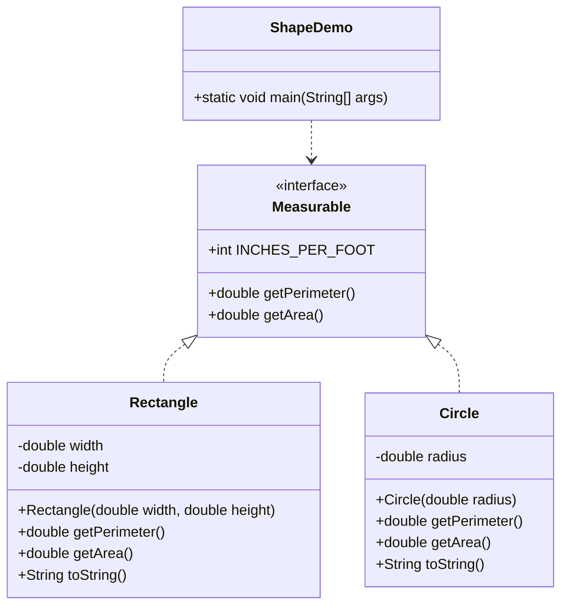
```mermaid
classDiagram
class Measurable {
  <<interface>>
  +int INCHES_PER_FOOT
  +double getPerimeter()
  +double getArea()
}

class Rectangle {
  -double width
  -double height
  +Rectangle(double width, double height)
  +double getPerimeter()
  +double getArea()
  +String toString()
}

class Circle {
  -double radius
  +Circle(double radius)
  +double getPerimeter()
  +double getArea()
  +String toString()
}

class ShapeDemo {
  +static void main(String[] args)
}

Measurable <|.. Rectangle
Measurable <|.. Circle
ShapeDemo ..> Measurable
```

Requirements:

- `Rectangle.getPerimeter()` returns `2 * (width + height)`.
- `Rectangle.getArea()` returns `width * height`.
- `Circle.getPerimeter()` returns `2 * Math.PI * radius`.
- `Circle.getArea()` returns `Math.PI * radius * radius`.
- In the demo, create a `Measurable[]` array containing both rectangles and circles.
- Loop through the array and print each object's area and perimeter.

---

## Problem 13. Custom Exception Calculator

Implement a calculator that uses custom checked exceptions.

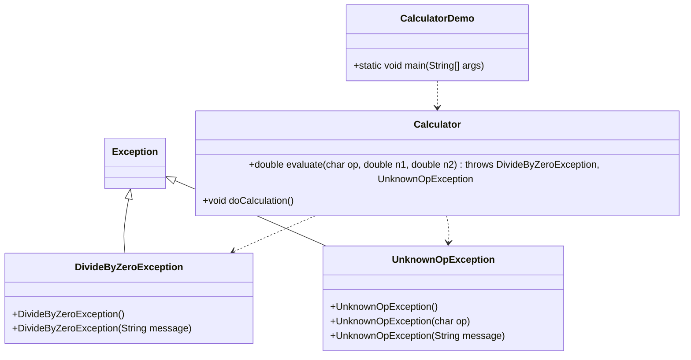
```mermaid
classDiagram
class DivideByZeroException {
  +DivideByZeroException()
  +DivideByZeroException(String message)
}

class UnknownOpException {
  +UnknownOpException()
  +UnknownOpException(char op)
  +UnknownOpException(String message)
}

class Calculator {
  +double evaluate(char op, double n1, double n2) throws DivideByZeroException, UnknownOpException
  +void doCalculation()
}

class CalculatorDemo {
  +static void main(String[] args)
}

Exception <|-- DivideByZeroException
Exception <|-- UnknownOpException
CalculatorDemo ..> Calculator
Calculator ..> DivideByZeroException
Calculator ..> UnknownOpException
```

Requirements:

- `evaluate('+', n1, n2)` returns addition.
- `evaluate('-', n1, n2)` returns subtraction.
- `evaluate('*', n1, n2)` returns multiplication.
- `evaluate('/', n1, n2)` returns division.
- Division by zero throws `DivideByZeroException`.
- Any other operator throws `UnknownOpException`.
- `doCalculation()` reads input using `Scanner` and catches both custom exceptions.

---

## Problem 14. Widget Order Exception Handling

Implement input validation with a custom exception.

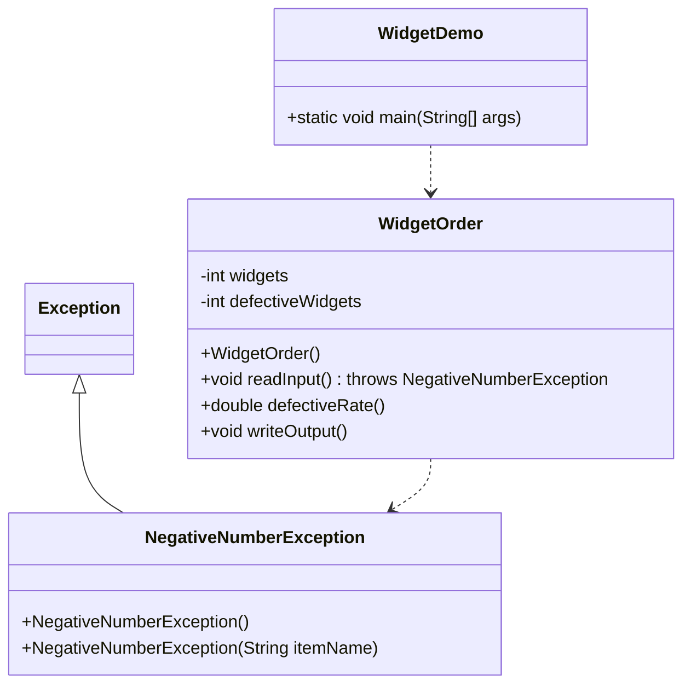
```mermaid
classDiagram
class NegativeNumberException {
  +NegativeNumberException()
  +NegativeNumberException(String itemName)
}

class WidgetOrder {
  -int widgets
  -int defectiveWidgets
  +WidgetOrder()
  +void readInput() throws NegativeNumberException
  +double defectiveRate()
  +void writeOutput()
}

class WidgetDemo {
  +static void main(String[] args)
}

Exception <|-- NegativeNumberException
WidgetDemo ..> WidgetOrder
WidgetOrder ..> NegativeNumberException
```

Requirements:

- Read the number of produced widgets and defective widgets.
- If either number is negative, throw `NegativeNumberException`.
- `defectiveRate()` returns `defectiveWidgets / widgets` as a `double`.
- Avoid division by zero.
- The demo catches the exception and prints its message.

---

## Problem 15. Text File Line Copier

Implement a text file copier. This problem tests file input, file output, exception handling, and closing streams.

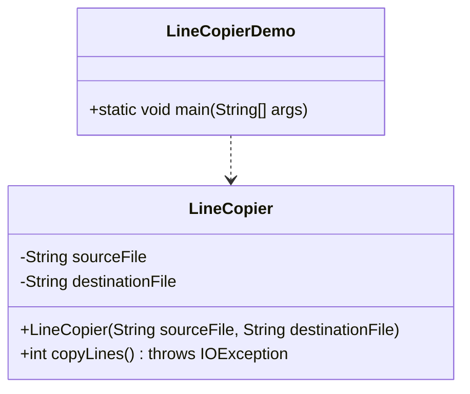
```mermaid
classDiagram
class LineCopier {
  -String sourceFile
  -String destinationFile
  +LineCopier(String sourceFile, String destinationFile)
  +int copyLines() throws IOException
}

class LineCopierDemo {
  +static void main(String[] args)
}

LineCopierDemo ..> LineCopier
```

Requirements:

- Use `BufferedReader` with `FileReader` to read the source file.
- Use `PrintWriter` with `FileWriter` to write the destination file.
- Copy every line from the source file to the destination file.
- Return the number of copied lines.
- Use `try-catch-finally` or try-with-resources.
- The demo should catch `IOException`.

---

## Problem 16. CSV Sales File Analyzer

Implement a file analyzer for comma-separated sales records.

Each input line has this format:

```text
itemName,quantity,price
```

Example:

```text
Pencil,10,0.50
Notebook,3,2.75
Eraser,5,0.30
```

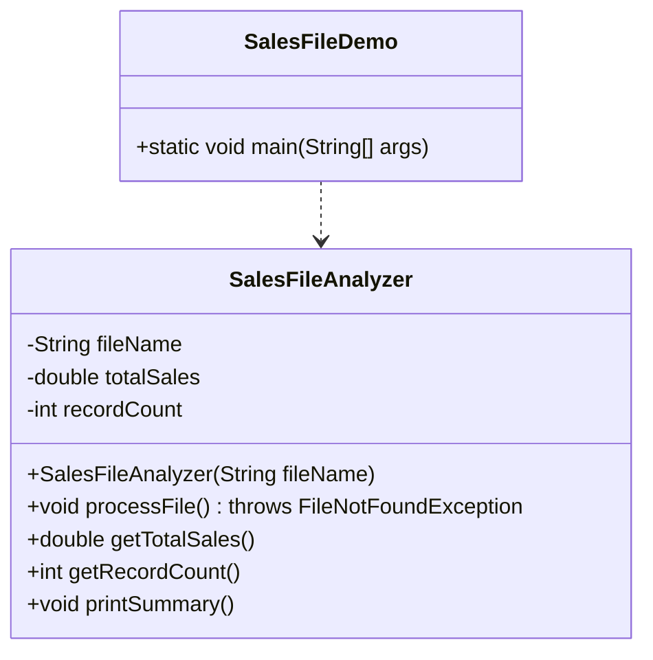
```mermaid
classDiagram
class SalesFileAnalyzer {
  -String fileName
  -double totalSales
  -int recordCount
  +SalesFileAnalyzer(String fileName)
  +void processFile() throws FileNotFoundException
  +double getTotalSales()
  +int getRecordCount()
  +void printSummary()
}

class SalesFileDemo {
  +static void main(String[] args)
}

SalesFileDemo ..> SalesFileAnalyzer
```

Requirements:

- Use `Scanner` with `new File(fileName)`.
- Split each line using comma as the delimiter.
- Convert quantity to `int`.
- Convert price to `double`.
- Add `quantity * price` to `totalSales`.
- Print the total number of records and total sales.
- Catch `FileNotFoundException` in the demo.

---

## Problem 17. Bank Account Menu Program

Implement a simple bank account program using a class plus a menu-driven demo.

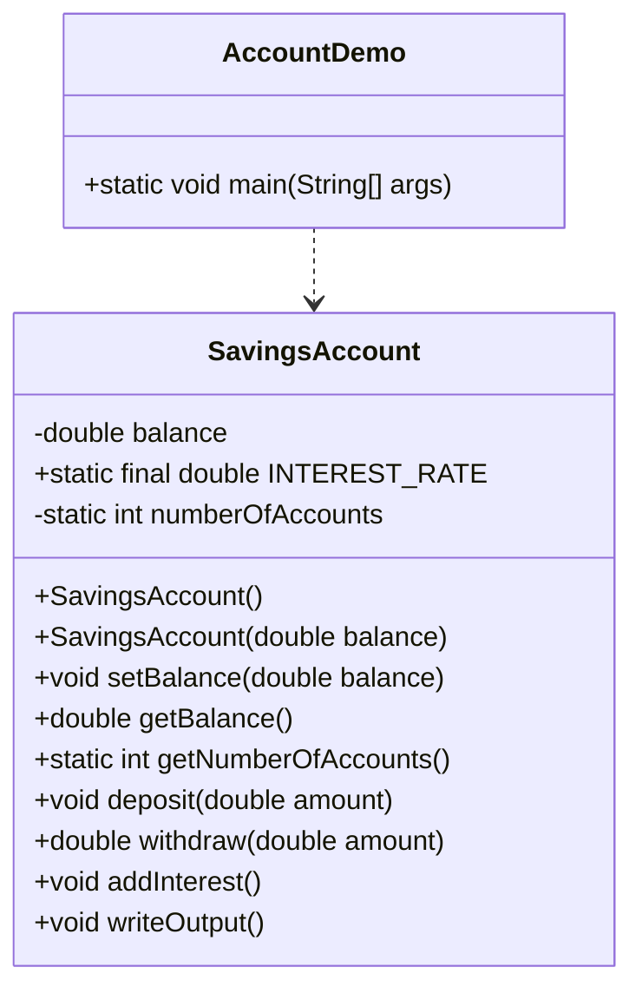
```mermaid
classDiagram
class SavingsAccount {
  -double balance
  +static final double INTEREST_RATE
  -static int numberOfAccounts
  +SavingsAccount()
  +SavingsAccount(double balance)
  +void setBalance(double balance)
  +double getBalance()
  +static int getNumberOfAccounts()
  +void deposit(double amount)
  +double withdraw(double amount)
  +void addInterest()
  +void writeOutput()
}

class AccountDemo {
  +static void main(String[] args)
}

AccountDemo ..> SavingsAccount
```

Requirements:

- Each constructor call increases `numberOfAccounts`.
- A negative initial balance becomes `0.0`.
- `deposit` ignores negative amounts.
- `withdraw` returns the actual amount withdrawn.
- If the requested withdrawal is greater than the balance, withdraw only the available balance.
- `addInterest()` increases the balance by the interest rate.
- The demo uses a `while` or `do-while` loop to offer menu choices.

---

## Problem 18. Method Overloading Average

Implement overloaded methods and a demo that shows which method is selected.

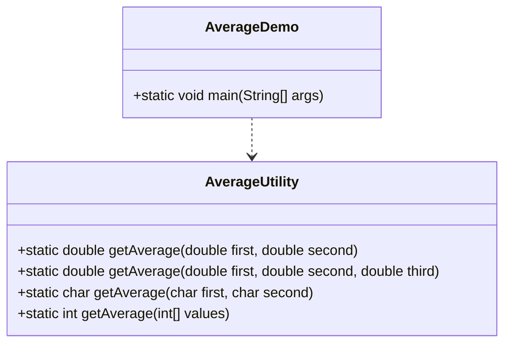
```mermaid
classDiagram
class AverageUtility {
  +static double getAverage(double first, double second)
  +static double getAverage(double first, double second, double third)
  +static char getAverage(char first, char second)
  +static int getAverage(int[] values)
}

class AverageDemo {
  +static void main(String[] args)
}

AverageDemo ..> AverageUtility
```

Requirements:

- The two-parameter `double` version returns the average of two numbers.
- The three-parameter `double` version returns the average of three numbers.
- The `char` version returns the character halfway between two characters.
- The `int[]` version returns the integer average of all array values.
- The demo calls every overloaded method.

---

## Fast Practice Checklist

Before the exam, be able to do these without notes:

- Draw Java fields and methods from a UML class diagram.
- Convert UML visibility: `+` public, `-` private, `#` protected.
- Create a test class with `public static void main(String[] args)`.
- Use `Scanner` safely after reading numbers and strings.
- Write constructors, getters, setters, and `equals`.
- Use `this` for instance fields and `super` for superclass constructors/methods.
- Override methods with the same signature.
- Create arrays of objects and initialize each element.
- Traverse 2D arrays with nested loops.
- Throw a custom exception and catch it in a demo class.
- Open, read, write, and close text files.

